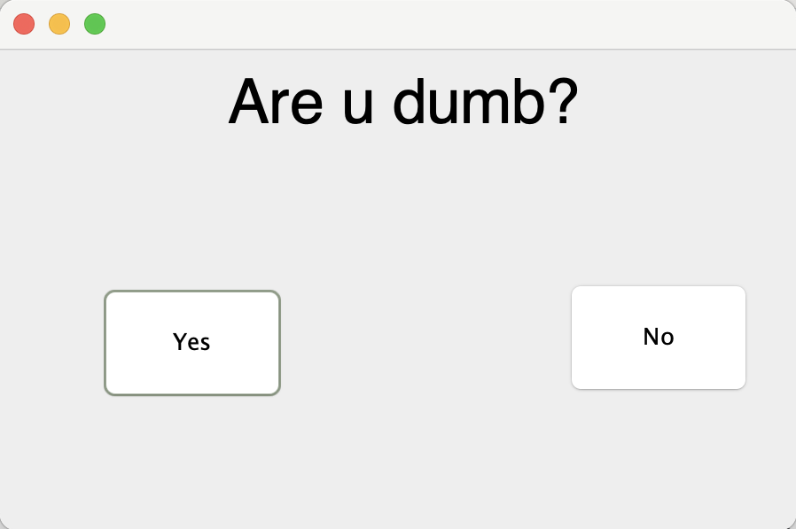

# Dummy App

A fun little Java Swing application that playfully asks: **"Are you dumb?"** 🧠  
Depending on your answer, you'll either be praised or teased—unless, of course, the "No" button runs away from you!

## Features

- A playful GUI built with Java Swing
- "Yes" and "No" buttons that react differently:
  - Click "Yes": Receive a teasing response ❤️
  - Hover over "No": The button runs away (unless toggled)
  - Click "No" (if you catch it!): Receive a smart compliment 😍
- Right-click anywhere to toggle the "No" button’s run-away behavior

## Screenshot



## How to Run

### Prerequisites

- Java Development Kit (JDK) installed (version 8 or later)
- An IDE like IntelliJ IDEA, Eclipse, or simple terminal access

### Steps

1. Clone the repository:
   ```
   git clone https://github.com/yourusername/dummy-app.git
   cd dummy-app
   ```

2. Compile and run:
   ```
   javac onee/Dummy.java
   java onee.Dummy
   ```


Or simply run it inside your favorite Java IDE.

## File Structure
```
dummy-app/
│
├── onee/
│   └── Dummy.java      # Main application code
│
└── README.md           # Project description
```

## License

This project is just for fun—feel free to use or modify it as you wish!

---

Happy clicking! 😄

